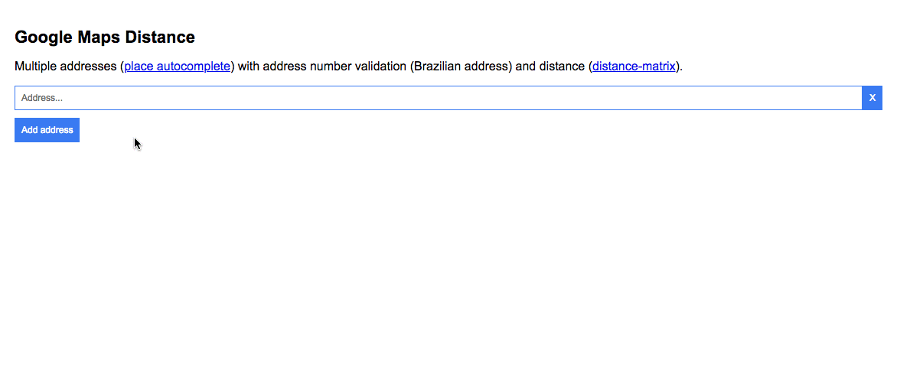

# Google Maps Distance

Multiple addresses ([place autocomplete](https://developers.google.com/places/web-service/autocomplete)) with address number validation (Brazilian address) and distance ([distance-matrix](https://developers.google.com/maps/documentation/distance-matrix/start)).

# JSFiddle
https://jsfiddle.net/giovanigenerali/9w3vuoqf/

## Autor
| [ @giovanigenerali](https://github.com/giovanigenerali) |
| :---: |
